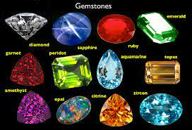
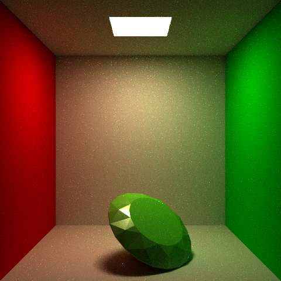
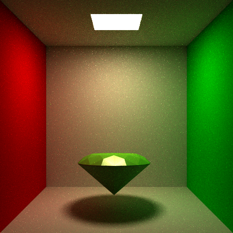
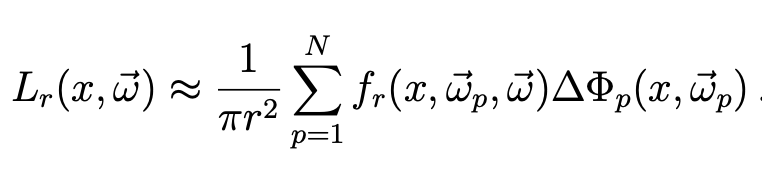

# Rendering Gems by Scott Lee

# Project Overview

I was first interested in implementing the interaction between gems and aurora borealis, but after doing some preliminary research it would have been too much to handle alone given the timespan. I tried to  focus on rendering gems and implementing the research from this [paper](https://dl.acm.org/doi/10.1145/1015706.1015708), but ultimately thought that implementing [photon mapping](https://graphics.stanford.edu/courses/cs348b-00/course8.pdf) would be more interesting.

## Implementation

### objloader
I was able to find a free diamond model on [cgtrader](https://www.cgtrader.com/free-3d-models/scripts-plugins/modelling/low-poly-diamond-6899deeb-29ce-4d74-aa69-cc5d6418a390). From there I incorporated [tinyobjloader](https://github.com/tinyobjloader/tinyobjloader) into my code to work together with the parser used in previous assignments. I added a new command for the test scenes: 

`obj pathToObjFile`

This allows me to utilize previous scenes and reuse transformation and material command formats. This also makes it easier to add multiple obj files to one scene.

The images below use 128 samples per pixel and multiple important sampling. 

### Photon mapping

#### Ray Generation
I started the process by creating a new ray generation program and closest hit integrator on optix. Some pseudocode was given for ray generation in the photon mapping paper. I used stratified sampling to evenly sample the origin for each photon ray on a quadlight. I also used cosine sampling for the direction of the photon since they are more likely to travel in aligment with the normal of the light.

#### Photon Tracing
For the integrator, I followed the russian roullete method outlined in the paper. Given $$K_{d}$$ for diffuse and $$K_{s}$$ for specular, the probability of reflection is calculated as such: 

$$P_{r} = max(K_{d}.x + K_{s}.x, K_{d}.y + K_{s}.y, K_{d}.z + K_{s}.z)$$

The probability of absorbtion would be $$P_{a} = 1 - P_{r}$$. 
Furthermore the probability of diffuse reflection:

$$P_{d} = \frac{K_{d}.x + K_{d}.y + K_{d}.z}{K_{d}.x + K_{d}.y + K_{d}.z + K_{s}.x + K_{s}.y + K_{s}.z}P_{r}$$

Probability of specular reflection:

$$P_{s} = \frac{K_{s}.x + K_{s}.y + K_{s}.z}{K_{d}.x + K_{d}.y + K_{d}.z + K_{s}.x + K_{s}.y + K_{s}.z}P_{r}$$

To determine whether a photon is reflected or absorbed, we can use the probability model below, for a random variable $$\xi$$.

$$\xi\in[0, P_{d}] \rightarrow \text{diffuse reflection}$$

$$\xi\in[P_{d}, P_{r}] \rightarrow \text{specular reflection}$$

$$\xi\in[P_{r}, 1] \rightarrow \text{absorbance}$$

Given the power of an incoming photon $$P_{inc}$$, the power of the specular reflected photon is calculated as such:

$$P_{refl}.x = P_{inc}.x K_{s}.x / P_{s}$$

$$P_{refl}.y = P_{inc}.x K_{s}.y / P_{s}$$

$$P_{refl}.z = P_{inc}.x K_{s}.z / P_{s}$$

The diffuse reflect power can be calculated in the same ways as above. 

To determine whether a ray is transmitted or reflected I use Schlick's approximation outline in this [paper](https://graphics.stanford.edu/courses/cs148-10-summer/docs/2006--degreve--reflection_refraction.pdf). We adapt the formula to russian roullette given the reflectance $$R_{schlick}$$.

$$\xi\in[0, R_{schlick}] \rightarrow \text{reflection}$$

$$\xi\in[R_{schlick}, 1] \rightarrow \text{refraction}$$

Then we divide the power of the reflected photon with the reflectance $$R_{schlick}$$. For a refracted photon we divide by the transmittance calculated as $$1 - R_{schlick}$$. Using the absorbance coefficient $$K_{a}$$, which is an rgb value, the color that is transmitted with each photon would be calculated by subtracting the coefficient by 1: $$1 -K_{a}$$

#### KD tree

A recursive algorithm to balance a set of photons is given in the photon mapping paper. It requires a median finding algorithm. I use the [median of medians algorithm](https://www.youtube.com/watch?v=RItfXpx3SD4) that has O(n) runtime. I had trouble with the balancing method for large sets of photons causing stack overflows due to deep recursion. This was caused by the median finding algorithm also being recursive, so the issue was fixed by implementing it iteratively. When loading the KD tree to the GPU, the tree can be formatted as an array using indices to determine parent child relationships. Given index p, the left and right child in array would be 2p + 1 and 2p + 2. The parent of p would be (p - 1) / 2.

Traversing the tree is another challenge to implementing a KD tree through CUDA since recursion is not allowed. I attempted to implement it iteratively using outlines from these [slides](https://www.colorado.edu/amath/sites/default/files/attached-files/k-d_trees_and_knn_searches.pdf). It follows the same structure as the recursive algorithm and uses indices to traverse down parent and child relationships. To determine whether both child's of a node have been visited, I added a boolean indicator. The variable is turned to true whenever we traverse down the second child, so that when we traverse back up it will indicate that the search for that node is complete. The variable is also set to false whenever we traverse up which resets the variable for future traversals. 

#### Radiance Calculation

Radiance is calculated using the formula below from the photon mapping paper:

Since the photon map only stores photons in diffuse surfaces, the radiance for specular surfaces should be calculated using brdf importance sampling, accumlating a throughput. 

### Results & Images

Unfortunately I was unable to succesfully render images using the photon map. There may be issues with the map construction, but construction is relatively quick. However, tree traversal for radiance samples past 10 took to long for quick renders, so there may be issues with my formulas there. Another issue may be with the radiance calcuation as I am not completely confident with how I approached the calculation. 

The images below show Schlick's approximation using BRDF importance sampling with around 500 spp. 
Index of refraction of the sphere in the first image is 1 and 2.42 in the second. 

The image below is a failed rendering of the photon map using 200,000 photons and 1 radiance sample.

# Resources
 - [Photon Mapping](https://graphics.stanford.edu/courses/cs348b-00/course8.pdf)
 - [Reflection and Refraction](https://graphics.stanford.edu/courses/cs148-10-summer/docs/2006--degreve--reflection_refraction.pdf)
 - [tinyobjloader](https://github.com/tinyobjloader/tinyobjloader)
 - [median of medians algorithm](https://www.youtube.com/watch?v=RItfXpx3SD4)
 - [heap implementation](https://algorithmtutor.com/Data-Structures/Tree/Binary-Heaps/)
 - [Slides found online for KNN algorithms](https://www.colorado.edu/amath/sites/default/files/attached-files/k-d_trees_and_knn_searches.pdf)
 - [Video on KD Trees](https://www.youtube.com/watch?v=Glp7THUpGow&ab_channel=StableSort)
 - [SIGGRAPH 04: Graphics gems revisited](https://dl.acm.org/doi/10.1145/1015706.1015708)


